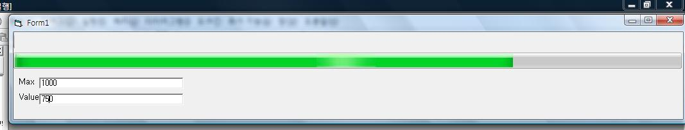



## Real Moving Vista Progress Bar

### Description

This is vista progressbar. It's white thing moves unlike others.

There are Graphic Files in there, but i bet it will be crash name in your computer... or not.
 
### More Info
 
It Sometimes Flickering. Because I Don't Know How To Double Buffering, And I Used the PictureBox to The vitural Buffer.

             |
---                |---
**Submitted On**   |2007-08-24 00:11:08
**By**             |[Nobody Cares](https://github.com/Planet-Source-Code/PSCIndex/blob/master/ByAuthor/nobody-cares.md)
**Level**          |Intermediate
**User Rating**    |5.0 (10 globes from 2 users)
**Compatibility**  |VB 6\.0
**Category**       |[Graphics](https://github.com/Planet-Source-Code/PSCIndex/blob/master/ByCategory/graphics__1-46.md)
**World**          |[Visual Basic](https://github.com/Planet-Source-Code/PSCIndex/blob/master/ByWorld/visual-basic.md)
**Archive File**   |[Real\_Movin208157922007\.zip](https://github.com/Planet-Source-Code/nobody-cares-real-moving-vista-progress-bar__1-69242/archive/master.zip)

